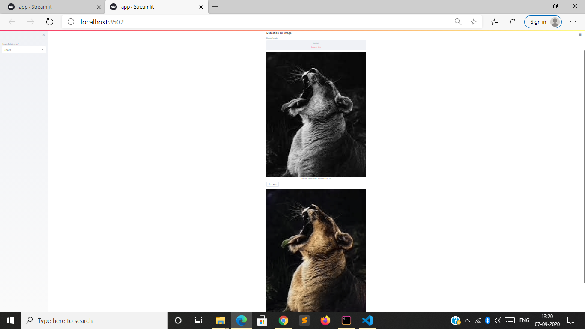

<h1 align="center">Image Colorizer App</h1>


<div align= "center">
  <h4>Image colorizer app built with OpenCV, Transfer Learning using Deep Learning and Computer Vision concepts in order to transform a black and white image to its colored variant</h4>
</div>


&nbsp;&nbsp;&nbsp;&nbsp;&nbsp;&nbsp;&nbsp;&nbsp;&nbsp;&nbsp;&nbsp;&nbsp;&nbsp;&nbsp;&nbsp;&nbsp;&nbsp;&nbsp;&nbsp;&nbsp;&nbsp;&nbsp;&nbsp;&nbsp;&nbsp;&nbsp;&nbsp;&nbsp;&nbsp;&nbsp;&nbsp;&nbsp;&nbsp;&nbsp;&nbsp;


 


## Tech/framework used

- [OpenCV](https://opencv.org/)
- [StreamLit](https://streamlit.io/)
- [Transfer Learning]


## Working

1. Open terminal. Go into the cloned project directory folder and type the following command:
```
$ python3 colorize.py --image images/ship.jpeg 
```


## Results


## Streamlit app

Image colorizer webapp using openCV & Streamlit

command
```
$ streamlit run app.py 
```
## Images

<p align="center">
  
</p>
<p align="center">Upload Images</p>

<p align="center">
  
</p>
<p align="center">Results</p>


## Acknowledgement
* [https://www.pyimagesearch.com/](https://www.pyimagesearch.com/)
* [http://richzhang.github.io/colorization/](http://richzhang.github.io/colorization/)
* [https://www.tensorflow.org/tutorials/images/transfer_learning](https://www.tensorflow.org/tutorials/images/transfer_learning)
